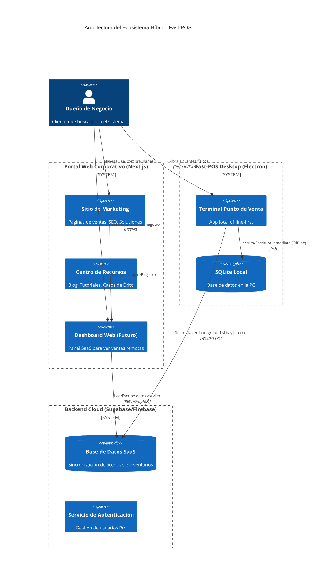
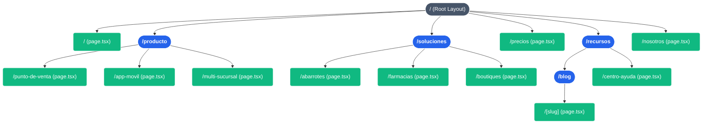
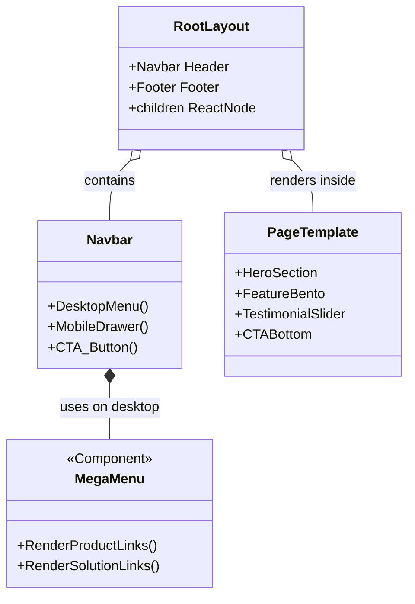

# 🏛️ Especificaciones de Arquitectura y Desarrollo: Portal SaaS Fast-POS

Este documento sirve como la **Guía Maestra para Desarrolladores** encargados de transformar y escalar la antigua landing page de un solo archivo hacia un **Portal Corporativo Multi-Página (SaaS)** construido con Next.js (App Router).

---

## 1. Visión Técnica y Stack

*   **Framework Frontend:** Next.js 14+ (App Router).
*   **Estilos:** Tailwind CSS + Framer Motion (para animaciones complejas y transiciones de páginas).
*   **Gestión de Estado (Futuro):** Zustand (si se requieren flujos de registro complejos) o simple React Context para preferencias de UI.
*   **CMS / Blog (Futuro):** Integración planeada con MDX o Sanity/Strapi para el blog y artículos de ayuda.
*   **SEO:** Implementación estricta de Metadata API de Next.js, Schema.org (JSON-LD) y OpenGraph.

---

## 2. Diagrama de Arquitectura Global (Ecosistema Fast-POS)

Este diagrama UML de componentes muestra cómo el nuevo Portal Web se relaciona con el producto instalable (Electron) y el futuro Backend SaaS.



---

## 3. Diagrama de Navegación y Enrutamiento (Sitemap App Router)

El portal utilizará el enrutamiento basado en archivos de Next.js (`src/app/`).



### Estructura de Carpetas Sugerida:
```bash
src/
├── app/
│   ├── layout.tsx            # Root Layout (Navbar y Footer globales)
│   ├── page.tsx              # Home Landing Page
│   ├── (marketing)/          # Route Group para lógica de marketing compartida
│   │   ├── producto/
│   │   │   ├── punto-de-venta/page.tsx
│   │   │   └── app-movil/page.tsx
│   │   ├── soluciones/
│   │   │   ├── abarrotes/page.tsx
│   │   │   └── farmacias/page.tsx
│   │   ├── precios/page.tsx
│   │   └── nosotros/page.tsx
│   └── (recursos)/           # Route Group para blog y docs
│       ├── blog/
│       │   ├── page.tsx      # Blog Index
│       │   └── [slug]/page.tsx # Dynamic Post
│       └── centro-ayuda/page.tsx
├── components/
│   ├── layout/               # Navbar, Footer, MobileMenu
│   ├── sections/             # Hero, CTA, PricingTables
│   └── ui/                   # Botones, Cards, Animaciones (Framer)
└── config/
    ├── navigation.ts         # JSON centralizado con los links del menú
    └── site.ts               # Metadata global
```

---

## 4. Diagrama de Relación de Componentes (UML)

Cómo se estructuran visualmente las páginas.



---

## 5. Requerimientos Funcionales y No Funcionales

### Rendimiento (Core Web Vitals)
*   **Mobile-First Performance:** Debido a que el 70%+ del tráfico vendrá de celulares, todos los efectos pesados de `framer-motion` (como blurs animados o canvas) deben estar deshabilitados o reducidos condicionalmente bajo el breakpoint `md`.
*   **Imágenes:** Uso estricto de `<Image>` de `next/image` con formatos `.webp` nativos y tamaños responsivos (`sizes="(max-width: 768px) 100vw, 50vw"`).

### SEO y Metadata
*   Cada ruta dentro de `src/app/` **debe exportar** su propia constante `metadata` con un título hiper-específico (Ej. `title: "Punto de Venta para Farmacias | Fast-POS"`).
*   URL amigables y en minúsculas. Sin parámetros query innecesarios.

### Componente de Navegación (`<Navbar />`)
*   **Desktop:** Debe implementar un "Mega Menu". Al pasar el ratón sobre "Soluciones", se debe desplegar un panel ancho mostrando las industrias con pequeños iconos representativos.
*   **Mobile:** Debe usar un menú de cajón (Drawer) o pantalla completa que oculte el menú al hacer scroll hacia abajo y lo muestre al hacer scroll hacia arriba (Smart Navbar).
*   **Sticky/Glassmorphism:** El Navbar debe tener `position: sticky` en el top, con `backdrop-blur` para dejar ver sutilmente el contenido por debajo al hacer scroll.

---

## 6. Plan de Implementación (Roadmap)

### FASE 1: Re-arquitectura Base (Semana 1)
1.  Crear estructura de carpetas de rutas en Next.js.
2.  Extraer el menú actual de `page.tsx` y construir el componente aislado `<Navbar />` (preparado para dropdowns).
3.  Implementar `<Footer />` global con mapa del sitio.
4.  Crear el archivo `src/config/navigation.ts` para mapear dinámicamente las rutas.

### FASE 2: Landing Pages de Soluciones (Nicho SEO)
1.  Crear el componente `<IndustryHero />` y `<IndustryFeatures />` reutilizable.
2.  Desarrollar ruta `/soluciones/abarrotes`.
3.  Desarrollar ruta `/soluciones/boutiques`.
4.  Desarrollar ruta `/soluciones/farmacias`.

### FASE 3: Páginas de Producto y Precios
1.  Desarrollar la vista detallada de `/producto/app-movil` enfocada cien por ciento en el Cloud Sync.
2.  Mover la sección actual de Pricing hacia `/precios` expandiendo la información (FAQs, Tablas comparativas).

### FASE 4: Centro de Recursos (Blog)
1.  Configurar lectura de archivos `.md` / `.mdx` locales o conectar un CMS.
2.  Crear el layout del artículo del blog.

---
*Este documento vivo debe actualizarse conforme evolucionen las necesidades del portal.*
